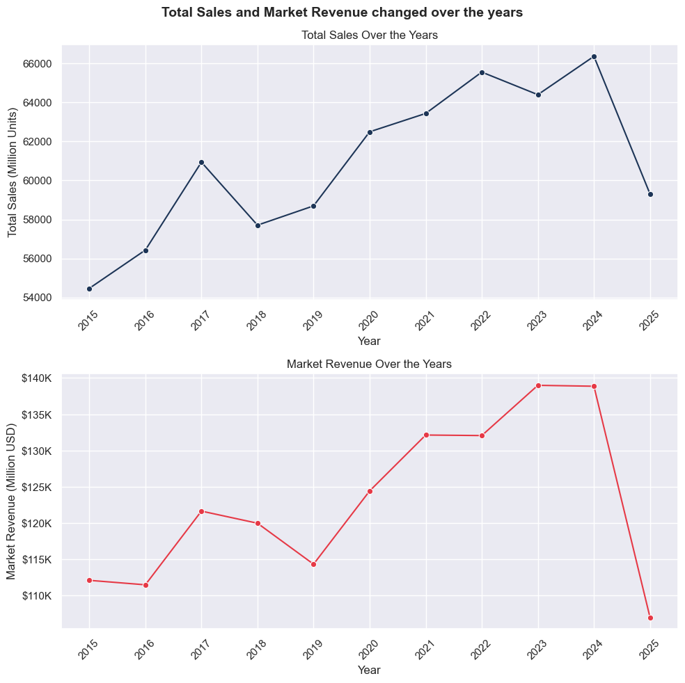
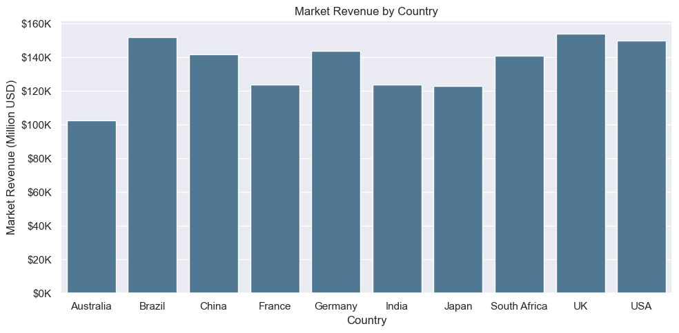

# Global Condom Sales and Awareness (2015-2025)

## Overview

This project analyzes data related to global condom sales, focusing on various factors such as market revenue, total sales, contraceptive usage, government campaigns, and awareness programs. The analysis covers multiple years and countries, offering insights into trends, correlations, and factors affecting sales. The goal is to identify key drivers behind condom sales, the impact of awareness campaigns, and how product preferences vary by gender, region, and year.

- Key Objectives
  Sales Trends: Explore the trends in Total Sales (Million Units) and Market Revenue (Million USD) over the years.

- Geographic Insights: Compare sales data across countries and identify regions contributing most to global sales.

- Impact of Awareness & Education: Analyze the relationship between Sex Education Programs, HIV Prevention Awareness, and Contraceptive Usage Rates.

- Teen Pregnancy & Contraceptive Usage: Investigate how Teen Pregnancy Rates correlate with condom sales.

- Market Dynamics: Understand the influence of Brand Dominance, Average Price per Condom, and Government Campaigns on the market.

## Analysis Questions

This analysis seeks to answer the following questions:

- How have Total Sales and Market Revenue changed over the years?

- Which countries contribute the most to global condom sales?

- What is the relationship between Teen Pregnancy Rates and Contraceptive Usage?

- How do Government Campaigns and Sex Education Programs influence condom sales?

## Tools i used for this analysis

- Python – General programming and data analysis

- Pandas – Data manipulation and preprocessing

- Matplotlib – Data visualization (charts and plots)

- Seaborn – Statistical data visualization

- Jupyter Notebook – Interactive coding and analysis

## Data Preparation and Cleanup

### Import & Clean Up Data

```python
import pandas as pd
import matplotlib.pyplot as plt
import seaborn as sns


df = pd.read_csv(r'D:\DA_Portfolio\Global Condom Sales and Awareness (2015-2025)\Dataset\Rich_Global_Condom_Usage_Dataset.csv')
df['Year'] = pd.to_datetime(df['Year'], errors='coerce', format='%Y')
df['Year'] = df['Year'].dt.year


df[['Male Purchases (%)', 'Female Purchases (%)']] = df['Male vs Female Purchases (%)'].str.extract(r'(\d+)% Male - (\d+)% Female')
df = df.drop(columns='Male vs Female Purchases (%)')

df.rename(columns={'Teen Pregnancy Rate (per 1000 teens)': 'Teen Pregnancy Rate (per 10000 teens)'}, inplace=True)

df['Male Purchases (%)'] = pd.to_numeric(df['Male Purchases (%)'], errors='coerce')
df['Female Purchases (%)'] = pd.to_numeric(df['Female Purchases (%)'], errors='coerce')

```

## The Analysis

### 1. How have Total Sales and Market Revenue changed over the years?

I grouped the dataset by Year to analyze total condom sales and market revenue from 2015 to 2025. Using .groupby('Year'), I summed up both 'Total Sales (Million Units)' and 'Market Revenue (Million USD)' to get yearly totals. The .reset_index() function was applied to convert the grouped data back into a structured DataFrame. This resulted in two datasets, Total_sales_years and Market_Revenue, providing insights into yearly sales volume and revenue trends.

```python
Total_sales_years = df.groupby('Year')['Total Sales (Million Units)'].sum().reset_index()
Total_sales_years
```

<div>
<style scoped>
    .dataframe tbody tr th:only-of-type {
        vertical-align: middle;
    }

    .dataframe tbody tr th {
        vertical-align: top;
    }

    .dataframe thead th {
        text-align: right;
    }

</style>
<table border="1" class="dataframe">
  <thead>
    <tr style="text-align: right;">
      <th></th>
      <th>Year</th>
      <th>Total Sales (Million Units)</th>
    </tr>
  </thead>
  <tbody>
    <tr>
      <th>0</th>
      <td>2015</td>
      <td>54462</td>
    </tr>
    <tr>
      <th>1</th>
      <td>2016</td>
      <td>56427</td>
    </tr>
    <tr>
      <th>2</th>
      <td>2017</td>
      <td>60940</td>
    </tr>
    <tr>
      <th>3</th>
      <td>2018</td>
      <td>57707</td>
    </tr>
    <tr>
      <th>4</th>
      <td>2019</td>
      <td>58696</td>
    </tr>
    <tr>
      <th>5</th>
      <td>2020</td>
      <td>62498</td>
    </tr>
    <tr>
      <th>6</th>
      <td>2021</td>
      <td>63441</td>
    </tr>
    <tr>
      <th>7</th>
      <td>2022</td>
      <td>65563</td>
    </tr>
    <tr>
      <th>8</th>
      <td>2023</td>
      <td>64404</td>
    </tr>
    <tr>
      <th>9</th>
      <td>2024</td>
      <td>66371</td>
    </tr>
    <tr>
      <th>10</th>
      <td>2025</td>
      <td>59309</td>
    </tr>
  </tbody>
</table>
</div>

```python
Market_Revenue = df.groupby('Year')['Market Revenue (Million USD)'].sum().reset_index()
Market_Revenues
```

<div>
<style scoped>
    .dataframe tbody tr th:only-of-type {
        vertical-align: middle;
    }

    .dataframe tbody tr th {
        vertical-align: top;
    }

    .dataframe thead th {
        text-align: right;
    }

</style>
<table border="1" class="dataframe">
  <thead>
    <tr style="text-align: right;">
      <th></th>
      <th>Year</th>
      <th>Market Revenue (Million USD)</th>
    </tr>
  </thead>
  <tbody>
    <tr>
      <th>0</th>
      <td>2015</td>
      <td>112116.041223</td>
    </tr>
    <tr>
      <th>1</th>
      <td>2016</td>
      <td>111498.776839</td>
    </tr>
    <tr>
      <th>2</th>
      <td>2017</td>
      <td>121652.645773</td>
    </tr>
    <tr>
      <th>3</th>
      <td>2018</td>
      <td>119982.827527</td>
    </tr>
    <tr>
      <th>4</th>
      <td>2019</td>
      <td>114338.835060</td>
    </tr>
    <tr>
      <th>5</th>
      <td>2020</td>
      <td>124430.527401</td>
    </tr>
    <tr>
      <th>6</th>
      <td>2021</td>
      <td>132132.404558</td>
    </tr>
    <tr>
      <th>7</th>
      <td>2022</td>
      <td>132058.441120</td>
    </tr>
    <tr>
      <th>8</th>
      <td>2023</td>
      <td>138978.587634</td>
    </tr>
    <tr>
      <th>9</th>
      <td>2024</td>
      <td>138854.770344</td>
    </tr>
    <tr>
      <th>10</th>
      <td>2025</td>
      <td>107013.578029</td>
    </tr>
  </tbody>
</table>
</div>

You can view my notebook with detailed steps [here](4.Total_sales_and_MR.ipynb).

#### Visualize Data

```python
fig, ax = plt.subplots(2,1, figsize=(10, 10))
sns.set_theme(style='darkgrid')
sns.lineplot(data=Total_sales_years, x='Year',y='Total Sales (Million Units)',ax=ax[0],marker='o',color='#1D3557')
ax[0].set_title('Total Sales Over the Years')
ax[0].set_xticks(Total_sales_years['Year'])
ax[0].set_xticklabels(Total_sales_years['Year'], rotation=45)


sns.lineplot(data=Market_Revenue, x='Year',y='Market Revenue (Million USD)',ax=ax[1],marker='o',color='#E63946')
ax[1].set_title('Market Revenue Over the Years')
ax[1].set_xticks(Market_Revenue['Year'])
ax[1].set_xticklabels(Market_Revenue['Year'], rotation=45)

ax[1].yaxis.set_major_formatter(plt.FuncFormatter(lambda x, _: f'${int(x/1000)}K'))
fig.suptitle('Total Sales and Market Revenue changed over the years', fontsize=14, fontweight='bold')
plt.tight_layout()
plt.show()
```



## Key Insights

- Steady Growth (2015-2024): Sales and revenue increased overall, peaking in 2023-2024.

- Fluctuations: Minor dips occurred but did not disrupt the upward trend.

- Sharp Decline (2025): A major drop in both sales and revenue suggests market shifts, saturation, or external factors.

### 2. Which countries contribute the most to global condom sales?

```python
df_countries_sales = df.groupby('Country')['Market Revenue (Million USD)'].sum().reset_index()
df_countries_sales
```

<div>
<style scoped>
    .dataframe tbody tr th:only-of-type {
        vertical-align: middle;
    }

    .dataframe tbody tr th {
        vertical-align: top;
    }

    .dataframe thead th {
        text-align: right;
    }

</style>
<table border="1" class="dataframe">
  <thead>
    <tr style="text-align: right;">
      <th></th>
      <th>Country</th>
      <th>Market Revenue (Million USD)</th>
    </tr>
  </thead>
  <tbody>
    <tr>
      <th>0</th>
      <td>Australia</td>
      <td>102544.986667</td>
    </tr>
    <tr>
      <th>1</th>
      <td>Brazil</td>
      <td>151467.522437</td>
    </tr>
    <tr>
      <th>2</th>
      <td>China</td>
      <td>141484.896667</td>
    </tr>
    <tr>
      <th>3</th>
      <td>France</td>
      <td>123580.047973</td>
    </tr>
    <tr>
      <th>4</th>
      <td>Germany</td>
      <td>143554.103961</td>
    </tr>
    <tr>
      <th>5</th>
      <td>India</td>
      <td>123681.243191</td>
    </tr>
    <tr>
      <th>6</th>
      <td>Japan</td>
      <td>122796.577851</td>
    </tr>
    <tr>
      <th>7</th>
      <td>South Africa</td>
      <td>140857.438589</td>
    </tr>
    <tr>
      <th>8</th>
      <td>UK</td>
      <td>153595.090535</td>
    </tr>
    <tr>
      <th>9</th>
      <td>USA</td>
      <td>149495.527637</td>
    </tr>
  </tbody>
</table>
</div>

#### Visualize Data

```python
plt.figure(figsize=(10,5))
sns.set_theme(style='darkgrid')


ax = sns.barplot(data=df_countries_sales, x='Country', y='Market Revenue (Million USD)',color='#457B9D')
ax.yaxis.set_major_formatter(plt.FuncFormatter(lambda x, _: f'${int(x/1000)}K'))


plt.ylabel("Market Revenue (Million USD)")
plt.xlabel("Country")
plt.title("Market Revenue by Country")
plt.tight_layout()
plt.show()
```



## Key Insights

So, looking at the chart, the UK and USA are clearly dominating with market revenues close to $150K. It's pretty obvious these two countries are powerhouses worth considering for business or investments. Brazil is doing well too, sitting just below the UK and USA, so it's definitely a market that stands out.

On the other hand, Australia has the lowest revenue—just above $100K—so it might be a smaller market compared to the others. As for the middle bunch like China, France, Germany, India, Japan, and South Africa, they're all between $120K and $140K. These seem like decent options if you're looking for moderate opportunities.
